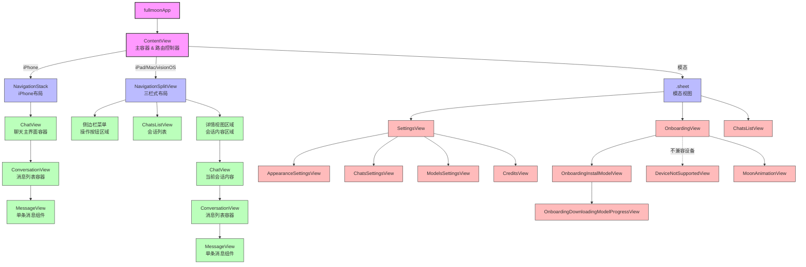

# Fullmoon iOS 项目代码文档报告

## 1. 项目概述

Fullmoon 是一款 iOS、macOS 和 visionOS 应用程序，允许用户在本地设备上与大型语言模型 (LLM) 进行私密聊天。它充分利用 Apple Silicon 芯片的优化特性，提供快速、高效且完全私密的 AI 交互体验。

## 2. 技术栈与架构

*   **UI 框架:** SwiftUI (跨平台原生界面)
*   **数据持久化:** SwiftData (本地数据存储与管理)
*   **核心 AI:** MLX, MLXLLM, MLXLMCommon (Apple Silicon 优化的本地 LLM 推理框架)
*   **Markdown 渲染:** MarkdownUI (高性能 Markdown 解析与渲染)
*   **架构模式:** MVVM (Model-View-ViewModel) 架构，通过 SwiftUI 的数据流管理机制实现：
    *   **Views:** SwiftUI 声明式视图，负责 UI 展示和用户交互
    *   **Models:** 数据模型 (SwiftData schema)、状态管理 (`AppManager`) 和核心逻辑 (`LLMEvaluator`, `DeviceStat`)
    *   **State Management:** 结合 `@StateObject`、`@EnvironmentObject`、`@Observable` 和 `@Published` 实现响应式数据流
    *   **App Entry:** `fullmoonApp` 作为应用程序入口点和依赖注入容器

### 2.1. 架构图

下面的架构图展示了 Fullmoon 应用的核心组件和它们之间的关系：

```mermaid
graph TD
    A[fullmoonApp\n入口点] --> |初始化/注入| B[AppManager\n全局状态管理器]
    A --> |初始化/注入| C[SwiftData\n数据持久化层]
    A --> |初始化/注入| D[LLMEvaluator\nLLM 推理引擎]
    
    B --> |@EnvironmentObject| E[ContentView\n主UI容器/路由]
    C --> |持久化| F[Data模型\nThread/Message]
    D --> |@EnvironmentObject| E
    
    E --> |包含| G[视图组件\nChatView等]
    F --> |读取/写入| H[UserDefaults\n轻量级存储]
    F <--> |输入/输出| I[MLX Framework\n设备端AI框架]
    D <--> I
    
    J[系统集成\nShortcuts/Siri] -.-> A
    K[外部依赖\nMarkdownUI] -.-> G
    
    classDef core fill:#f9f,stroke:#333,stroke-width:2px;
    classDef data fill:#bbf,stroke:#333,stroke-width:1px;
    classDef ui fill:#bfb,stroke:#333,stroke-width:1px;
    classDef external fill:#ddd,stroke:#333,stroke-width:1px,stroke-dasharray: 5 5;
    
    class A,B,D core;
    class C,F,H data;
    class E,G ui;
    class I,J,K external;
```

#### 数据流向说明

1. **用户交互流程**:
   - 用户在 UI 层 (如 ChatView) 输入消息
   - 通过 @EnvironmentObject 将请求传递给 LLMEvaluator
   - LLMEvaluator 调用 MLX 框架执行模型推理
   - 生成结果通过响应式数据绑定返回并更新 UI

2. **数据持久化流程**:
   - AppManager 管理应用配置，存储于 UserDefaults
   - Thread/Message 模型通过 SwiftData 持久化到本地数据库
   - 模型状态 (如已安装模型列表) 通过 AppManager 序列化保存

3. **依赖注入链**:
   - fullmoonApp 作为根组件初始化核心服务
   - 通过 Environment 将这些服务注入到视图层
   - 视图组件声明依赖，通过属性包装器接收这些服务

#### 核心模块职责

- **View Layer**: 负责用户界面渲染和交互捕获
- **AppManager**: 应用配置和全局状态协调器
- **LLMEvaluator**: 模型加载、推理和结果处理的核心引擎
- **SwiftData Models**: 数据结构定义和持久化逻辑
- **MLX Framework**: 底层模型计算和硬件优化

这种架构设计实现了关注点分离、单向数据流和响应式更新，使应用在保持高性能的同时也具有良好的可维护性和可扩展性。

## 3. 关键组件分析

### 3.1. 应用入口 (`fullmoonApp.swift`)

*   定义 `fullmoonApp` 结构体，符合 `App` 协议，作为 SwiftUI 应用的入口点
*   使用 `@main` 标记指定为应用程序启动入口
*   初始化并注入关键的环境对象：
    *   `AppManager`: 全局应用状态管理器，负责用户偏好和应用配置
    *   `LLMEvaluator`: LLM 模型加载与推理引擎，处理 AI 模型的核心功能
    *   `DeviceStat`: 设备资源监视器，追踪 GPU 使用情况等硬件指标
*   配置 SwiftData 的 `modelContainer`，用于管理持久化 `Thread` 和 `Message` 实体
*   实现特定于 macOS 的 `AppDelegate`，处理窗口生命周期和管理逻辑
*   配置主 `WindowGroup`，嵌入 `ContentView` 并应用全局环境对象
*   为不同平台配置特定参数：
    *   macOS 和 visionOS: 设置最小窗口尺寸约束
    *   macOS: 添加特定命令菜单项（如 "Show Main Window"）

### 3.2. 主视图 (`ContentView.swift`)

*   作为应用的主要用户界面容器和路由控制器
*   实现平台自适应布局：
    *   iPad/Mac/visionOS: 采用 `NavigationSplitView` 实现三栏式布局（侧边栏、会话列表、详情视图）
    *   iPhone: 使用紧凑型 `NavigationStack` 加 `ChatView` 布局，支持滑动手势
*   核心状态管理：
    *   `@State` 变量：`showOnboarding`, `showSettings`, `showChats`, `currentThread`, `isPromptFocused`
    *   `@EnvironmentObject` 接收：`appManager`, `llm`, `deviceStat`
*   **生命周期与业务逻辑:**
    *   `.task` 修饰符: 视图出现时异步检查模型状态并决定是否显示引导流程
    *   `.sheet` 修饰符: 管理模态视图的展示（会话列表、设置、引导）
    *   手势识别: 在 iPhone 上实现侧滑手势调出会话列表
*   全局样式应用：
    *   动态主题色: `.tint(appManager.tintColor)`
    *   字体样式: `.fontDesign(.variable)`, `.dynamicTypeSize`, `.fontWidth`
*   分析追踪: 记录应用访问次数 (`appManager.incrementNumberOfVisits()`)

### 3.3. 模型层 (`Models/`)

*   **`AppManager.swift`:**
    *   符合 `ObservableObject` 协议，作为全局状态容器和业务逻辑协调器
    *   持久化状态管理:
        *   使用 `@AppStorage` 持久存储用户偏好设置
        *   **主要状态:** `systemPrompt`, `appTintColor`, `appFontDesign`, `appFontSize`, `appFontWidth`, `currentModelName`, `shouldPlayHaptics`, `numberOfVisits`
    *   模型管理:
        *   `@Published var installedModels`: 已下载模型列表，变更时自动序列化到 `UserDefaults`
        *   提供模型发现、安装、切换的业务逻辑
    *   平台适配:
        *   `userInterfaceIdiom`: 计算属性，智能检测当前运行平台，优化 UI 呈现
    *   功能性方法: 
        *   触觉反馈管理（haptics）
        *   模型展示格式化
        *   月相图标动态生成（基于当前日期）

*   **`Data.swift`:**
    *   定义 SwiftData 持久化模型:
        *   `Message`: 聊天消息实体
            *   属性: `id`, `role`, `content`, `timestamp`, `generatingTime`
            *   关系: `thread` 多对一关系指向所属会话
        *   `Thread`: 聊天会话实体
            *   属性: `id`, `title`, `timestamp`
            *   关系: `messages` 一对多关系链接所有消息
            *   计算属性: `sortedMessages` 提供基于时间戳的排序视图
    *   定义应用配置枚举:
        *   `Role`: 消息角色（用户/助手）
        *   UI 配置枚举: `AppTintColor`, `AppFontDesign`, `AppFontSize`, `AppFontWidth`

*   **`DeviceStat.swift`:**
    *   使用 Swift 5.9 的 `@Observable` 宏，提供细粒度观察机制
    *   资源监控:
        *   使用 `MLX.GPU.snapshot()` 直接获取 GPU 硬件指标
        *   通过 `Timer.publish` 实现周期性采样更新
    *   提供实时 `gpuUsage` 数据以支持 UI 中的资源使用指示器

*   **`LLMEvaluator.swift`:**
    *   使用 `@Observable` 宏，作为 LLM 推理核心引擎
    *   状态管理:
        *   运行状态: `running`, `cancelled`, `isThinking`, `loadState`
        *   输出管理: `output`, `thinkingTime`, `collapsed`
        *   性能监控: `modelInfo`, `stat`, `progress`, `startTime`, `tokensPerSecond`
        *   配置状态: `modelConfiguration`
    *   核心方法:
        *   `load(modelName:)`: 异步方法，实现模型的懒加载与缓存
            *   处理下载进度回调
            *   实现模型切换与内存管理
        *   `generate(modelName:thread:systemPrompt:)`: 异步执行推理
            *   构建包含历史上下文的输入提示
            *   调用底层 `MLXLMCommon.generate` 流式生成
            *   通过 `@MainActor` 标记的方法更新 UI 绑定状态
            *   实现 token 限制与取消机制
            *   统计并报告推理性能指标
        *   `stop()`: 安全取消正在进行的生成任务
        *   `switchModel(_:)`: 实现模型间无缝切换

*   **`Models.swift`:**
    *   扩展 `ModelConfiguration` (从 `MLXLMCommon` 导入)
    *   定义模型类型系统:
        *   `ModelType` 枚举: `regular` (标准对话), `reasoning` (推理增强型)
    *   模型库管理:
        *   预配置多种尺寸和类型的模型 (`llama_3_2_1b_4bit`, `qwen3_1_7b_4bit` 等)
        *   `availableModels`: 提供可用模型列表
        *   `defaultModel`: 设定默认模型配置
    *   工具方法:
        *   `getModelByName(_:)`: 模型查找函数
        *   `getPromptHistory(thread:systemPrompt:)`: 构建符合特定模型格式要求的对话历史
        *   `formatForTokenizer(_:)`: 针对不同模型架构优化输入格式（解决如 Jinja 模板兼容性问题）
        *   `modelSize`: 估算模型磁盘与内存占用

*   **`RequestLLMIntent.swift`:**
    *   实现 `AppIntent` 协议，提供系统级 Shortcuts 集成
    *   参数定义:
        *   `continuous`: 是否持续对话的标志
        *   `prompt`: 用户输入的提示文本
    *   执行逻辑 `perform()`:
        *   创建独立的 `LLMEvaluator` 和 `AppManager` 实例
        *   模型加载与状态验证
        *   临时会话和消息创建
        *   异步推理调用与结果处理
        *   条件分支处理 (`continuous` 参数)，决定返回方式
        *   错误状态处理（如无可用模型）
    *   提供 `NewChatShortcut` 配置，定义在快捷指令中的展示方式

### 3.4. 视图层 (`Views/`)

*   **`Chat/`:**
    *   `ChatView.swift`: 
        *   聊天主界面容器
        *   集成输入控件、工具按钮和聊天记录
        *   管理输入状态和发送/停止逻辑
        *   嵌入 `ConversationView` 显示消息流
    *   `ChatsListView.swift`: 
        *   会话管理列表视图
        *   实现搜索、创建、删除、重命名功能
        *   使用 SwiftData 查询和过滤会话
        *   支持拖放和上下文菜单操作
    *   `ConversationView.swift`: 
        *   展示单个会话的消息流
        *   使用 `ScrollViewReader` 实现自动滚动
        *   实现消息加载和动态插入
        *   处理空状态和加载状态
    *   `MessageView.swift`: 
        *   单条消息的渲染组件
        *   区分用户和助手消息样式
        *   使用 `MarkdownUI` 渲染富文本内容
        *   特殊处理 `<think>` 标签，支持展开/折叠

*   **`Onboarding/`:**
    *   `OnboardingView.swift`: 应用首次启动的引导流程主容器
    *   `OnboardingInstallModelView.swift`: 模型选择与安装界面
    *   `OnboardingDownloadingModelProgressView.swift`: 下载进度实时反馈界面
    *   `DeviceNotSupportedView.swift`: 不兼容设备的错误提示界面
    *   `MoonAnimationView.swift`: 月相变化动画视图，用于品牌展示

*   **`Settings/`:**
    *   `SettingsView.swift`: 设置主界面，提供分类导航
    *   `AppearanceSettingsView.swift`: 视觉风格配置（颜色主题、字体样式）
    *   `ChatsSettingsView.swift`: 聊天行为设置（系统提示词、历史记录管理）
    *   `ModelsSettingsView.swift`: LLM 模型管理中心（安装、选择、删除）
    *   `CreditsView.swift`: 致谢和版权信息展示页面

### 3.5. 视图层次结构图

下图展示了 Fullmoon 的视图层次结构和导航流程：



#### 平台特定导航流程

1. **iOS (iPhone)**：
   - 主导航基于 `NavigationStack`
   - 主页面为 `ChatView`，显示单个会话
   - 通过侧滑手势或按钮显示 `ChatsListView`（模态）
   - 设置和引导体验通过模态 sheet 呈现

2. **iPad/macOS/visionOS**：
   - 主导航基于 `NavigationSplitView`（三栏布局）
   - 左侧为工具按钮区域
   - 中间为会话列表（`ChatsListView`）
   - 右侧为当前选中会话内容（`ChatView`）
   - 设置和引导体验同样通过模态 sheet 呈现

3. **通用模式**：
   - 所有视图共享相同的环境对象（`AppManager`, `LLMEvaluator`）
   - 消息渲染逻辑跨平台统一
   - 响应式布局根据屏幕尺寸自动调整

这种视图层次结构使 Fullmoon 能够在保持代码统一的同时，针对不同设备类型提供最佳的用户体验。通过 SwiftUI 的条件渲染和自适应布局，应用可以无缝适应从 iPhone 小屏幕到 Mac 大显示器的各种尺寸和方向。

## 4. 核心功能

*   **本地 LLM 推理:** 
    *   完全设备端运行，无需云服务连接
    *   利用 Apple Silicon 神经网络引擎加速
    *   保证用户数据隐私和离线使用能力

*   **流式生成:** 
    *   实时字符级响应显示
    *   支持中途取消和暂停
    *   显示生成速度和资源使用统计

*   **多会话管理:** 
    *   创建和组织多个独立对话
    *   会话持久化和检索
    *   标题自动生成和手动编辑

*   **Markdown 支持:** 
    *   完整的 Markdown 语法渲染
    *   代码块语法高亮
    *   表格和列表渲染
    *   内联图片引用支持

*   **模型管理:** 
    *   多模型并存与切换
    *   按需下载和缓存
    *   模型性能监控和指标展示

*   **个性化设置:** 
    *   主题色与字体风格自定义
    *   系统提示词编辑
    *   消息行为和界面布局偏好

*   **跨平台适配:** 
    *   单一代码库支持 iOS、macOS 和 visionOS
    *   针对不同设备特性优化 UI/UX
    *   适配不同尺寸和方向

*   **系统集成:** 
    *   Shortcuts 和 Siri 集成
    *   分享扩展支持
    *   适配深色模式

*   **隐私优先设计:** 
    *   完全本地处理，无网络依赖
    *   无用户数据收集和上传
    *   符合 Apple 隐私标准

### 4.1. LLM 模型处理流程图

下图展示了从用户输入到 AI 响应生成的完整流程：

```mermaid
flowchart TD
    subgraph 输入层
        A1[用户输入消息]
        B1[历史对话上下文\nThread的messages属性]
        B2[系统提示词\nAppManager.systemPrompt]
        B3[当前用户输入\n用户刚输入的内容]
        
        A1 --> B1
        A1 --> B2
        A1 --> B3
        B1 & B2 & B3 --> C1
    end
    
    subgraph LLMEvaluator处理流程
        C1[LLMEvaluator.generate\n核心推理方法]
        C1 --> D1[1. 准备输入提示]
        D1 --> D2[2. 检查模型状态]
        D2 --> D3[3. 启动推理任务]
        D3 --> D4[4. 流式结果处理]
        
        D1 -.-> F1[格式化历史记录]
        D1 -.-> F2[应用系统提示词]
        D1 -.-> F3[准备模型输入]
        
        D2 -.-> G1[懒加载模型]
        D2 -.-> G2[验证资源可用性]
        D2 -.-> G3[设置推理参数]
        
        D3 -.-> H1[调用MLX推理]
        D3 -.-> H2[开启并发任务]
        D3 -.-> H3[跟踪起始时间]
        
        D4 -.-> I1[实时显示输出]
        D4 -.-> I2[监控性能指标]
        D4 -.-> I3[处理生成终止]
    end
    
    subgraph 输出层
        D4 --> J1[生成消息保存\n创建新Message实体]
        J1 --> J2[更新UI显示状态\n结束loading状态]
        J2 --> J3[性能统计记录\ntokens/秒等指标]
    end
    
    subgraph 控制机制
        K1[取消生成机制]
        K2[错误处理和恢复机制]
        
        K1 -.-> K11[llm.stop()]
        K1 -.-> K12[Task.checkCancellation]
        K1 -.-> K13[提前终止输出流]
        
        K2 -.-> K21[模型加载失败处理]
        K2 -.-> K22[资源不足提示]
        K2 -.-> K23[自动重试策略]
        
        K1 -.-> C1
        K2 -.-> C1
    end
    
    classDef input fill:#d5f5e3,stroke:#1e8449,stroke-width:1px;
    classDef process fill:#d4e6f1,stroke:#2874a6,stroke-width:2px;
    classDef output fill:#f9e79f,stroke:#b7950b,stroke-width:1px;
    classDef control fill:#f5b7b1,stroke:#cb4335,stroke-width:1px;
    classDef step fill:#ebdef0,stroke:#8e44ad,stroke-width:1px;
    
    class A1,B1,B2,B3 input;
    class C1,D1,D2,D3,D4 process;
    class F1,F2,F3,G1,G2,G3,H1,H2,H3,I1,I2,I3 step;
    class J1,J2,J3 output;
    class K1,K2,K11,K12,K13,K21,K22,K23 control;
```

#### LLM 推理过程关键步骤详解

1. **输入预处理阶段**
   - **历史记录格式化**：根据不同模型类型（regular/reasoning）调整历史格式
   - **提示词组合**：合并系统提示词和历史消息，构建完整上下文
   - **输入标记化**：将文本转换为模型可处理的标记序列

2. **模型执行阶段**
   - **模型加载**：按需懒加载，支持从网络下载或本地缓存读取
   - **计算资源分配**：为推理任务分配 GPU 和内存资源
   - **批次处理**：对长文本输入进行分批处理，避免内存溢出

3. **生成过程管理**
   - **自动化 EOS 检测**：识别生成结束标记，优雅终止生成
   - **Token 限制**：实现最大生成长度控制
   - **温度控制**：通过采样温度参数调整输出随机性

4. **输出处理阶段**
   - **流式更新**：通过 `@MainActor` 实时更新 UI 绑定
   - **特殊标签处理**：识别并处理 `<think>` 等特殊内容标记
   - **性能统计**：计算和记录实时生成速度和资源使用情况

5. **优化机制**
   - **缓存管理**：智能缓存常用模型和中间状态
   - **注意力机制优化**：针对 Apple Silicon 特性优化注意力计算
   - **量化技术**：使用 4-bit 量化提高推理速度和减少内存占用

这一流程设计不仅确保了高效的本地 AI 推理，还通过细致的状态管理、错误处理和资源优化，提供了流畅的用户体验和高质量的响应生成。

## 5. 主要依赖

*   **SwiftUI:** Apple 的声明式 UI 框架，用于构建跨平台原生界面
*   **SwiftData:** iOS 17+ 引入的现代数据持久化框架，提供声明式数据模型和查询能力
*   **MLX & MLXLLM & MLXLMCommon:** Apple 开源的机器学习框架，专为 Apple Silicon 优化
*   **MarkdownUI:** 第三方高性能 Markdown 渲染库，支持 SwiftUI 集成
*   **AppIntents:** Apple 的意图框架，用于实现 Shortcuts 和 Siri 集成

## 6. 总结

Fullmoon 是一款技术先进的本地 LLM 应用，充分利用 Apple 生态系统的独特优势。它结合了 SwiftUI 的跨平台能力、SwiftData 的数据管理和 MLX 的设备端 AI 推理，创建了无需网络连接、保护用户隐私的 AI 聊天体验。

项目采用现代 Swift 编程范式和最佳实践，包括:
- 响应式编程模型 (`@Observable`, `@Published`)
- 系统级集成 (AppIntents, SwiftData)
- 异步并发处理 (Swift Concurrency)
- 模块化和可测试架构

Fullmoon 代表了在 Apple 平台上构建高性能、用户友好且注重隐私的 AI 应用的范例，展示了如何将先进的机器学习能力融入原生应用体验。